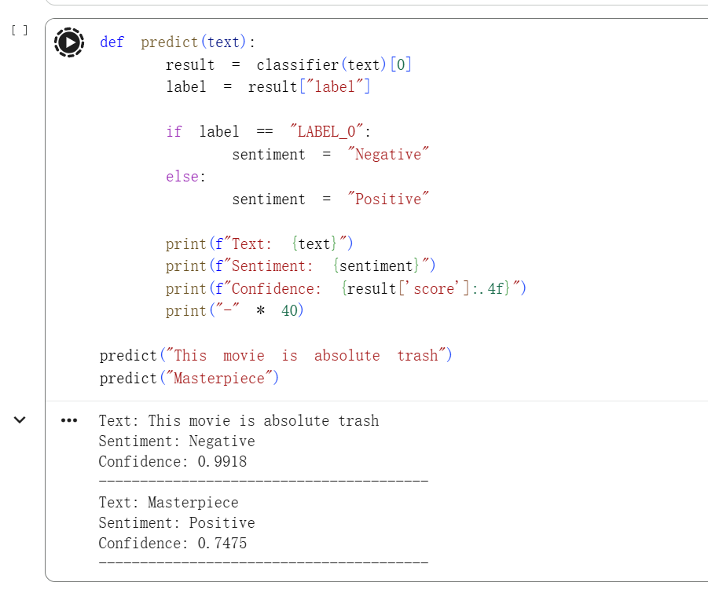
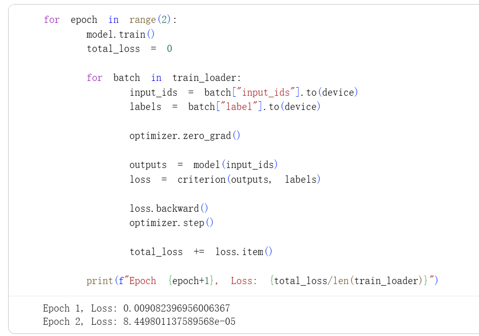

 # Transformer IMDB Sentiment Analysis

## 项目简介

本项目基于 Transformer 架构完成 IMDB 电影评论情感分类任务，
包含两个部分：

1. 手写实现 Self-Attention 机制
2. 使用预训练模型进行推理验证

通过本项目，我理解了 Transformer 的核心计算流程，
并分析了从零训练与预训练模型的差异。

---

## 环境说明

- Python 3.8+
- PyTorch
- Transformers (HuggingFace)

---

## 运行结果截图

### 模型预测结果

### 测试准确率

### 测试损失值

---

## 学习心得

本周我系统学习了 Transformer 架构，并围绕 IMDB 情感分类任务进行了完整实践。

在手写实现阶段，我重点实现了：

- Q、K、V 的线性变换
- 注意力分数的计算 QK^T
- 除以 √d 的缩放操作
- softmax 归一化
- 加权求和得到输出

通过打印张量 shape，我理解了矩阵乘法在注意力机制中的意义，
也意识到 Q 代表“查询什么”，K 代表“提供什么信息”，
V 则是真正传递的内容。

在搭建 TransformerEncoder 进行 IMDB 分类时，
我经历了几个重要问题：

1. 初始测试准确率异常接近 1.0  
   后来排查发现测试集采样存在类别偏差，
   导致模型只预测单一类别也能获得高准确率。

2. 修正采样后准确率下降到接近 0.5  
   说明模型在小规模数据上泛化能力不足，
   出现过拟合现象。

通过这次实验，我真正理解到：

- Transformer 参数量较大，需要大量数据支撑
- 小数据场景下从零训练效果有限
- 预训练模型具有明显优势

因此，在最后阶段我使用 HuggingFace 的预训练模型进行推理，
对比发现预测结果更加稳定且置信度更合理。

这次实践让我从“会使用模型”转变为“理解模型内部原理”，
也让我认识到深度学习不仅是调参，
更重要的是数据、结构和理论之间的结合。

## 参考资料

- Attention Is All You Need
- HuggingFace Transformers Documentation
- PyTorch 官方文档
